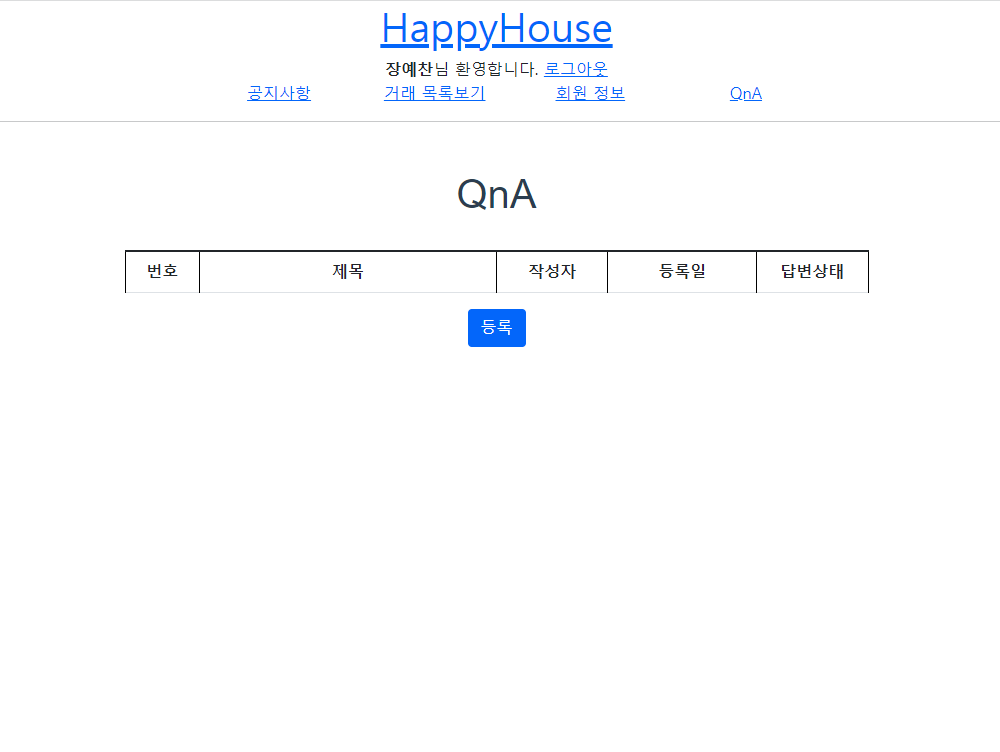
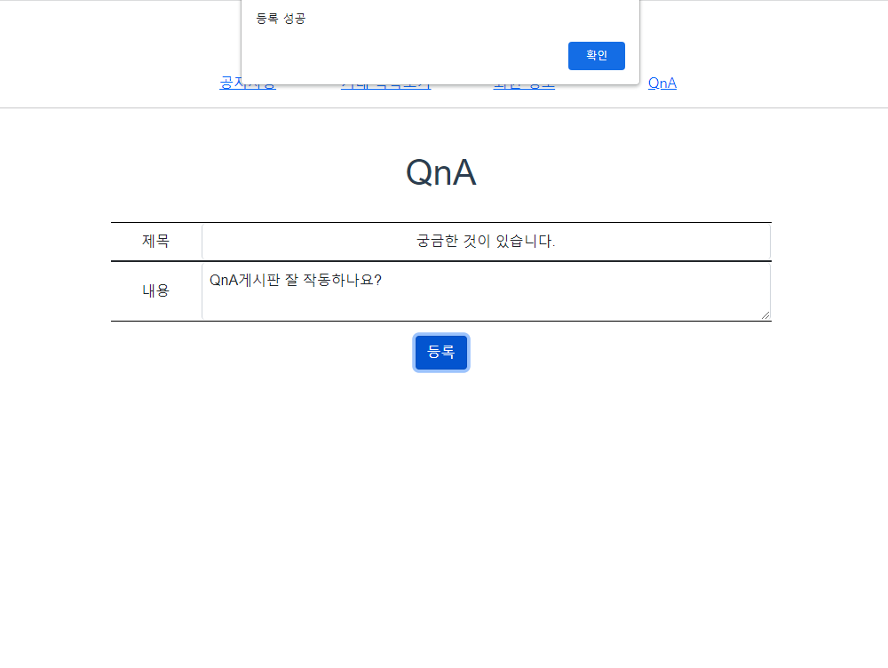
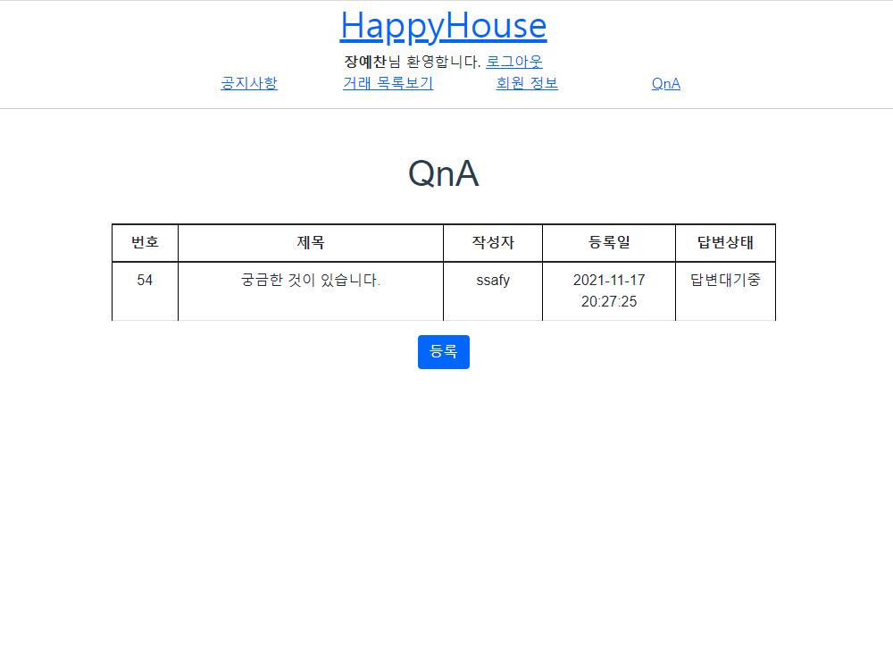
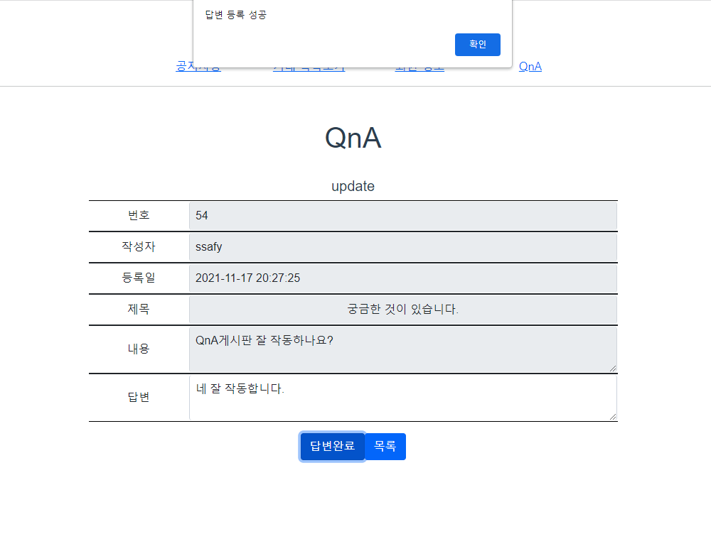
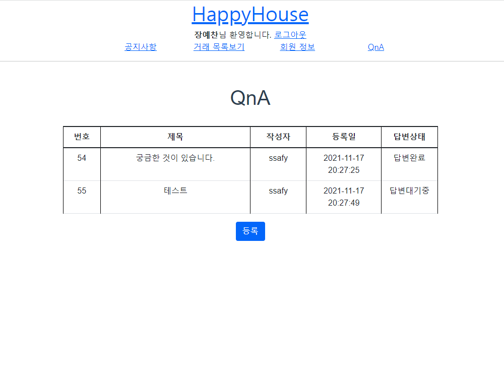
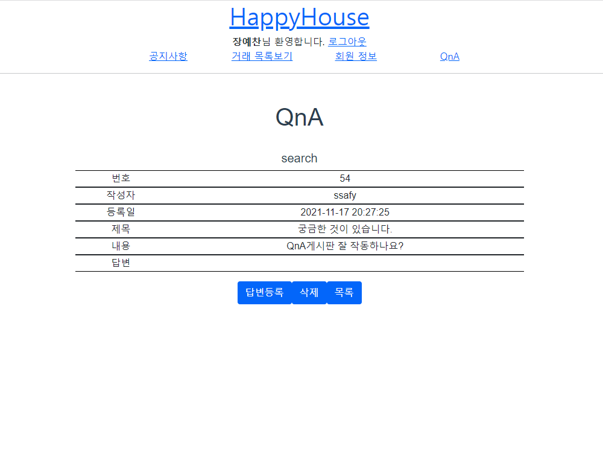

관통 프로젝트 제출 방법

# 관통프로젝트: HappyHouse_Vue_부울경_04반
### 제출일: 2020.11.17
### 참여 페어
- 장예찬, 지수민

### 처리된 요구사항 목록
  
|난이도|구현기능|세부|작성여부(O/X)|
|:---:|---|---|:---:|
|기본|QnA 게시판 Vue를 적용한 웹페이지|게시글목록|O|
|기본|QnA 게시판 Vue를 적용한 웹페이지|게시글등록|O|
|기본|QnA 게시판 Vue를 적용한 웹페이지|게시글수정|O|
|기본|QnA 게시판 Vue를 적용한 웹페이지|게시글검색|O|
|기본|서버측 구현|게시글 등록|O|
|기본|서버측 구현|게시글 수정|O|
|기본|서버측 구현|게시글 삭제|O|
|기본|서버측 구현|게시글 상세검색|O|
|기본|서버측 구현|게시글 목록|O|
|추가|동네 업종 정보 조회||X|
|추가|동네 환경 점검 정보 조회||X|
|심화|메인페이지 or 추가 기능||X|

* 작성된 기능은 반드시 캡쳐되어야 합니다.(GUI 실행화면, 콘솔 출력 등) 
* 추가로 구현한 기능을 표에 추가시키세요.

### 실행화면 캡쳐 - 
TODO: 요구사항 목록에서 완료 처리된 사항의 캡쳐 이미지를 등록하세요.

구현 기능: 게시글목록

구현 기능: 게시글등록

구현 기능: 게시글수정

구현 기능: 게시글검색

