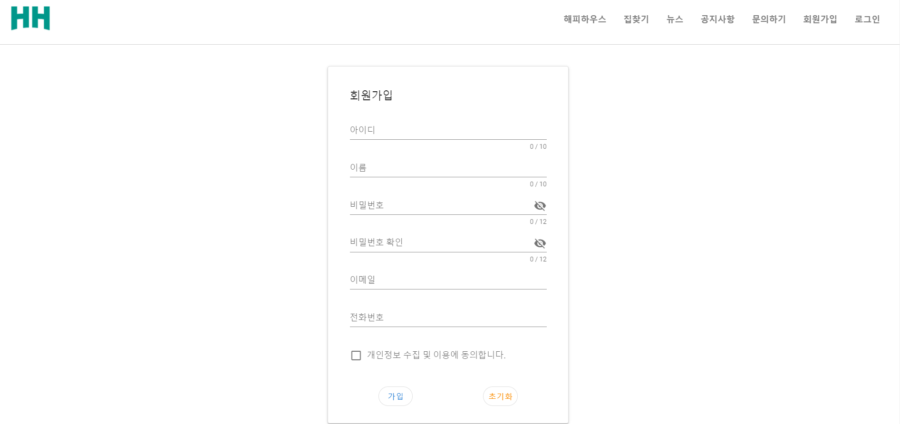

# **🏡 HappyHouse**

 

  

## **💡 소개**

- **진행기간** : 2021.11.17 ~ 2021.11.26

- **팀원** : 장예찬(팀장) , 지수민(팀원)

- **기획배경**

  - 코로나19로 인한 집콕 세대 증가
  - 부동산 주택 관심도 증가
  - 주변환경과 전망을 알려주는 서비스 필요

- 전국 아파트 실거래 공공데이터를 사용하여 쉽고 편리하게 사이트를 이용할 수 있도록 지도, 아파트 정보를 다양한 방식으로 제공합니다.

- 삼성 청년 소프트웨어 아카데미 1학기 프로젝트 우수상 수상

 

## **🧰 기술스택**

  &nbsp  
  &nbsp 
  &nbsp 
  &nbsp 
  &nbsp 
  &nbsp 
  &nbsp 
  &nbsp 
  &nbsp 

 

## **✨ 기능**

- **검색 기능**

  - 주소, 아파트명 검색
  - 주변 상권정보, 녹지정보 검색
  - 아파트 상세정보

- **지도**

  - kakao map API
  - 지도 위 마커 클릭 시 지도 이동과 장소에 관한 프리뷰 제공
  - 상권 정보 카테고리별 조회 기능
  - 녹지 정보 필터링 기능

- **공지사항**

  - 공지사항 관리(관리자) : 등록, 수정, 삭제
  - 공지사항 조회

- **Q&A**

  - 문의하기(사용자) : 등록, 삭제
  - 답변하기(관리자) : 답변, 수정

- **회원 관리**

  - 로그인, 비밀번호 찾기
  - 회원 등록, 수정, 탈퇴
  - 회원 정보 관리(관리자)

- **관심 설정**

  - 원하는 아파트 찜 추가, 삭제
  - 관심지역을 설정하면 해당 지역 미세먼지 조회

- **뉴스 정보**

  - 최근 부동산 뉴스 조회

- **데이터분석**
  - 해당 지역 평균 가격
  - 전체 회원 찜 목록 중 가장 인기있는 아파트 순위별 조회
  - 최근 거래 가격 그래프
  - 해당 아파트 주변 기반 시설 목록 제공

 

## **💻 화면**

### 메인 페이지

> 아파트명으로 검색을 할 수 있고, 인기 아파트와 관심지역 아파트를 조회할 수 있다. 또한 최근 공지사항과 Q&A 확인 할 수 있다.

 

### 해피하우스

> 해피하우스 웹 사이트 소개 페이지입니다.

 

### 집찾기

> 아파트명 또는 주소 검색을 통해 해당 아파트 목록을 확인 할 수 있습니다. 아파트 리스트에 마우스를 오버하거나 지도의 마커를 클릭 시 정보를 확인 할 수 있습니다. 또한 주변 상권 정보와 녹지 정보도 지도로 확인 할 수 있습니다.

 

### 찜기능 & 아파트 상세 정보

> 하트 아이콘을 클릭하여 관심 아파트를 추가, 삭제 할 수 있으며, 원하는 아파트를 클릭하면 상세정보를 확인할 수 있습니다. 상세정보 페이지에서는 아파트정보, 최근 거래 금액 그래프, 1km 내의 주변 기반 시설 목록들을 카테고리별로 확인 할 수 있습니다.

 

### 뉴스

> 최근 네이버 부동산 관련 뉴스를 크롤링한 데이터를 해피하우스 사이트에서 확인 할 수 있습니다.

 

### 공지사항

> 관리자는 공지사항을 등록, 수정, 삭제 할 수 있으며, 사용자들은 공지사항을 조회할 수 있습니다.

 

### Q & A

> 사용자는 문의글을 등록할 수 있으며, 관리자는 문의글의 답변을 등록할 수 있습니다.

 

### 회원관리

> 관리자는 회원의 정보들을 조회, 등록, 수정, 삭제 할 수 있습니다.

 

### 마이페이지

> 사용자는 회원정보를 수정, 탈퇴 할 수 있습니다.

 

### 관심 아파트 목록

> 사용자가 찜 추가한 아파트 목록을 확인 할 수 있습니다.

 

### 관심 지역

> 사용자는 관심 지역을 등록하면 해당 지역의 미세먼지 정보를 확인 할 수 있습니다.

 

### 로그인

 

### 회원가입

 
